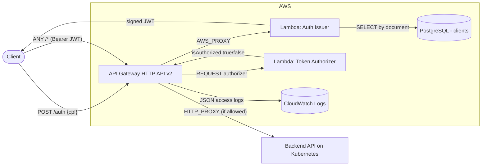
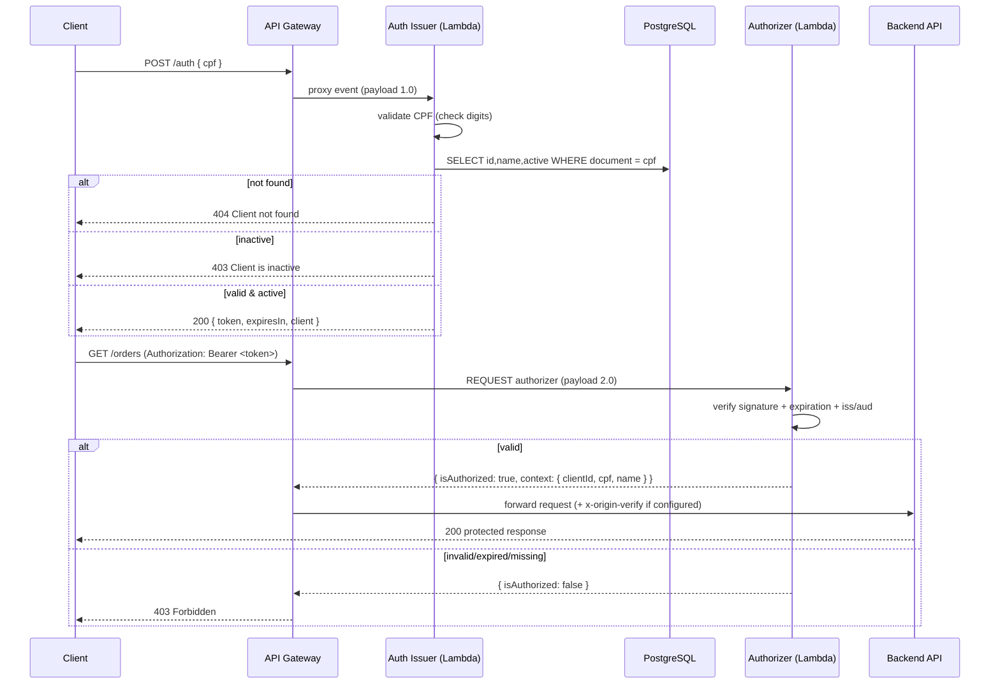

# os-management-lambda

Serverless **CPF authentication + API Gateway** for the os-management platform
(FIAP SOAT — Tech Challenge Fase 3).

This repository is the **authentication edge** of the platform. It contains the AWS
Lambda functions **and** the API Gateway that fronts them, with Terraform + CI/CD to:

1. **Issue tokens** — validate a client's CPF, confirm the client exists and is **active**
   in the database, and return a signed **JWT**.
2. **Authorize requests** — validate that JWT on protected API Gateway routes before
   traffic reaches the backend on Kubernetes.
3. **Route** — expose `POST /auth` publicly and proxy every other route to the backend,
   guarded by the authorizer.

> **The API Gateway used to live in a separate `os-management-gateway` repo.** It was
> merged here because the gateway and the auth Lambdas share one contract (routes, the
> `/auth` integration, the authorizer wiring, the JWT `iss`/`aud`/secret) and one deploy
> cadence. One repo → one PR, one review, one `terraform apply`, one rollback. The old
> repo should be archived. This also keeps the project at the **four repositories** the
> Tech Challenge asks for: this one, infra-k8s, infra-db, and the app.

---

## Components

| Component | Handler / resource | Role |
|---|---|---|
| **Auth issuer** | `com.os.workshop.auth.AuthHandler` | `POST /auth` — validates CPF, checks client status in the DB, **issues** a JWT. Runs in the VPC to reach the database. |
| **Token authorizer** | `com.os.workshop.auth.TokenAuthorizerHandler` | HTTP API **REQUEST authorizer** — **validates** the JWT on protected routes and returns a *simple response* (`{isAuthorized, context}`). No DB access. |
| **API Gateway** | `aws_apigatewayv2_api` (HTTP API v2) | `POST /auth` → issuer; `ANY /{proxy+}` → backend, guarded by the authorizer. |

All three sign/verify with the **same shared `JWT_SECRET`** (HS256) and, when configured,
the same `JWT_ISSUER` / `JWT_AUDIENCE`, so tokens issued here verify across the platform.

---

## Technologies

- **Java 21**, Maven (fat jar via `maven-shade-plugin`)
- **jjwt 0.13.0** (HS256) — same library/version as the main app
- **PostgreSQL JDBC** — lookup on `clients.document`
- **AWS Lambda** + **AWS API Gateway (HTTP API v2)** — provisioned with **Terraform**
- **AWS X-Ray** — active tracing on both Lambdas
- **CloudWatch Logs** — structured JSON access logs on the API Gateway stage
- **GitHub Actions** — CI (test + `terraform validate` + `terraform plan` on PRs) and
  CD (`develop`→homolog, `main`→prod)

### Why HTTP API v2 (not REST API)

| | REST API (v1) | HTTP API (v2) — chosen |
|---|---|---|
| Price after free tier | US$3.50 / million | **US$1.00 / million** |
| Private integration to the app | VPC Link **needs a paid NLB** | **VPC Link is free**, straight to an ALB |
| Authorizer caching | per-method IAM policy → cached policy denies other routes (403) | **simple responses** are not method-scoped → bug cannot happen |
| CORS | `OPTIONS` + mock per resource | one `cors_configuration` block |
| Deployment | `aws_api_gateway_deployment` + `triggers` hash | stage `auto_deploy = true` |

We use none of the REST-only features (API keys, usage plans, request/response
transformation, resource policies), so HTTP API is a clean win. Trade-off: HTTP API has
no gateway-level X-Ray — covered by access-log latency fields + Lambda tracing + the
Datadog/New Relic integration on the K8s side.

---

## Architecture



### Authentication sequence



---

## API

### `POST /auth`

```json
{ "cpf": "529.982.247-25" }
```

CPF is accepted formatted or as raw digits.

| Status | Body | Meaning |
|---|---|---|
| `200` | `{ "token": "...", "expiresIn": 3600000, "client": { "id": 1, "name": "JOAO DA SILVA" } }` | Authenticated |
| `400` | `{ "error": "Invalid CPF" }` / `{ "error": "CPF is required" }` | Bad/missing CPF |
| `404` | `{ "error": "Client not found" }` | No client with that document |
| `403` | `{ "error": "Client is inactive" }` | Client exists but is deactivated |

JWT payload:

```json
{
  "sub": "52998224725",
  "clientId": 1,
  "name": "JOAO DA SILVA",
  "roles": ["CLIENT"],
  "iss": "os-management-auth",
  "aud": "os-management-api",
  "iat": 1690000000,
  "exp": 1690003600
}
```

### Protected routes

Any other path is `ANY /{proxy+}` — send `Authorization: Bearer <token>`. A missing header
is rejected by API Gateway with **401** (the authorizer is not even invoked); an invalid or
expired token is rejected by the authorizer with **403**.

### Postman / Bruno

The platform API collection lives in the main `os-management` repo under
`bruno/os-management-api`. Point the `baseUrl` environment variable at the API Gateway
stage URL — the `api_base_url` Terraform output, also published to SSM at
`/os-management/<env>/api/base_url`.

---

## Build & test locally

```bash
./mvnw clean verify        # compile + run unit tests
./mvnw package             # build the Lambda fat jar (target/os-management-lambda.jar)
```

## Deploy (Terraform)

Prerequisites: the S3 state bucket, the shared `os-management` EKS state (VPC subnets,
node SG, RDS URL), and a reachable backend URL (var `origin_url` **or** the SSM parameter
`/os-management/<env>/app/origin_url`).

```bash
cd terraform
cp terraform.tfvars.example terraform.tfvars   # fill in real values (never commit)

terraform init \
  -backend-config="bucket=<state-bucket>" \
  -backend-config="key=lambda/homolog/terraform.tfstate" \
  -backend-config="region=us-east-1"

terraform apply
```

Key outputs: `api_base_url`, `auth_endpoint`, `api_id`.

### Environment variables consumed by the functions

| Variable | Function | Purpose |
|---|---|---|
| `DB_URL`, `DB_USERNAME`, `DB_PASSWORD` | issuer | database connection |
| `JWT_SECRET` | issuer + authorizer | HS256 sign/verify (shared) |
| `JWT_ISSUER`, `JWT_AUDIENCE` | issuer + authorizer | stamped as `iss`/`aud` and enforced |
| `JWT_EXPIRATION` | issuer | token lifetime (ms, default 3 600 000 = 1 h) |

### Shared infrastructure via remote state

VPC subnets, the EKS node security group, and the RDS JDBC URL are read from the
`os-management` EKS Terraform state (`terraform_remote_state`). This requires os-management
deployed in EKS mode and exposing: `private_subnet_ids`, `node_security_group_id`,
`rds_jdbc_url`. The issuer Lambda attaches to the EKS node SG (the SG RDS already allows on
5432).

### Cross-repo contract (published to SSM)

| Parameter | Written by | Read by |
|---|---|---|
| `/os-management/<env>/app/origin_url` | app / infra-k8s pipeline | this repo (gateway proxy target) |
| `/os-management/<env>/api/base_url` | **this repo** | app (Bruno), docs |
| `/os-management/<env>/auth/jwt_issuer` | **this repo** | app (JWT validation) |
| `/os-management/<env>/auth/jwt_audience` | **this repo** | app (JWT validation) |

---

## What the main app (`os-management`) must do

The app currently issues its own client tokens and its `JwtFilter` looks the subject up as a
`User` by e-mail — so a **CPF-subject token from this Lambda is rejected today**. To close
the integration:

1. Stop issuing client tokens in the app; the Lambda `/auth` is the client auth path.
2. Add a filter that builds the `Authentication` straight from the **validated claims**
   (`sub` = CPF, `clientId`, `roles=[CLIENT]`) — no `loadUserByUsername` DB round-trip.
3. Validate the same `JWT_SECRET`, `iss` (`os-management-auth`) and `aud`
   (`os-management-api`) — read from SSM above.
4. If `origin_verify_token` is set here, reject requests without the matching
   `x-origin-verify` header (defence in depth for the public LB).
5. Keep `/health`, `/v3/api-docs/**`, `/swagger-ui/**` unauthenticated.

---

## CI/CD

- **Branch protection:** `main` (prod) and `develop` (homolog) — no direct commits; merges
  via Pull Request; prod behind a required review (GitHub Environment).
- **CI** (`.github/workflows/ci.yml`): on PRs to `develop`/`main` and on `feature/**` —
  Java tests, `terraform fmt`/`validate`, and `terraform plan` (preview of the change).
- **CD** (`.github/workflows/cd.yml`): on push to `develop` → **homolog**, to `main` →
  **prod** — builds the jar and runs `terraform apply` (Lambdas **and** API Gateway).

### Required GitHub configuration

Repo **variables**: `TF_STATE_BUCKET`, `AWS_REGION`.

Repo **secrets**: `AWS_ACCESS_KEY_ID`, `AWS_SECRET_ACCESS_KEY`, `DB_USER`, `DB_PASSWORD`,
`JWT_SECRET`; optionally `ORIGIN_URL` (if not using SSM) and `ORIGIN_VERIFY_TOKEN`.

> `DB_USER`, `DB_PASSWORD`, `JWT_SECRET`, `TF_STATE_BUCKET`, `AWS_REGION` and the AWS keys
> use the **same names and values** as os-management — reuse them.

---

## Cost (AWS Free Tier)

| Resource | Free tier | Note |
|---|---|---|
| API Gateway HTTP API | 1M req/month for 12 months | then US$1.00/M |
| Lambda | 1M req/month + 400k GB-s, always free | issuer in VPC, no NAT |
| CloudWatch Logs | 5 GB ingest + 5 GB storage, always free | 14-day retention set |
| X-Ray | 100k traces/month recorded, always free | |
| SSM Parameter Store (Standard) | free | cross-repo contract |
| **Not** created here | — | RDS, EKS, NAT, Secrets Manager — see the infra repos |

---

## Notes / future hardening

- **Unauthorized is 403, not 401.** HTTP API simple-response authorizers can only allow or
  deny; a denied request maps to 403. A missing `Authorization` header is still 401.
- **Secrets are Lambda env vars** (encrypted at rest with an AWS-managed KMS key). The old
  cosmetic Secrets Manager resources were removed — they cost money while the code still
  read env vars. Migrating to Secrets Manager **with rotation** is the future step.
- **HS256 shared secret**: any component that verifies can also forge. RS256 (private key
  only in the issuer, public key / JWKS everywhere else) is the proper fix and would let
  the authorizer Lambda be replaced by HTTP API's native JWT authorizer.
- **`ClientRepository`** opens a fresh JDBC connection per invocation — hoist it to a static
  field (or enable SnapStart) to cut RDS handshake latency.
- Remember to add the **`soat-architecture`** user to this repository.
