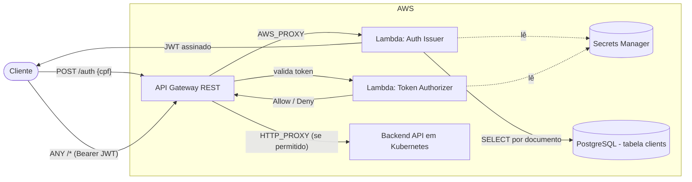
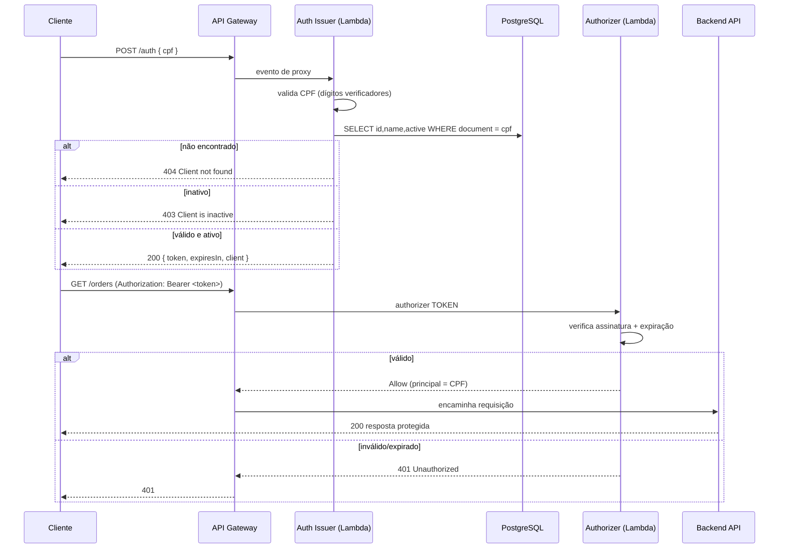

# os-management-lambda

Autenticação serverless de **CPF** para a plataforma os-management (FIAP SOAT — Tech Challenge Fase 3).

Este repositório contém as funções AWS Lambda e o Terraform/CI-CD necessários para:

1. **Emitir tokens** — validar o CPF de um cliente, confirmar que o cliente existe e está **ativo** no banco, e devolver um **JWT** assinado.
2. **Autorizar requisições** — validar esse JWT nas rotas protegidas do API Gateway antes que o tráfego chegue ao backend.

---

## Responsabilidades (duas funções, um contrato)

| Função | Handler | Papel |
|---|---|---|
| **Auth issuer** | `com.os.workshop.auth.AuthHandler` | `POST /auth` — valida o CPF, verifica o status do cliente no banco, **emite** um JWT. Roda dentro da VPC para alcançar o banco. |
| **Token authorizer** | `com.os.workshop.auth.TokenAuthorizerHandler` | Authorizer `TOKEN` do API Gateway — **valida** o JWT nas rotas protegidas. Sem acesso ao banco. |

Ambas assinam/validam com o **mesmo `JWT_SECRET` compartilhado** (HS256), de forma que os tokens emitidos aqui são verificáveis em toda a plataforma.

> O issuer apenas *emite*; o authorizer apenas *valida*. Um cliente se autentica uma vez em `/auth`, depois envia `Authorization: Bearer <token>` em cada chamada protegida.

---

## Tecnologias

- **Java 21**, Maven (fat jar via `maven-shade-plugin`)
- **jjwt 0.13.0** (HS256) — mesma biblioteca/versão usada pela aplicação principal
- **PostgreSQL JDBC** — consulta em `clients.document`
- **AWS Lambda** (funções) — provisionadas com **Terraform**. O API Gateway que
  expõe essas funções vive no repositório **`os-management-gateway`** e as referencia
  via `terraform_remote_state`.
- **AWS Secrets Manager** — armazenamento gerenciado do `JWT_SECRET` e das credenciais do banco
- **GitHub Actions** — CI (testes + `terraform validate`) e CD (`develop` e `main` fazem deploy)

---

## Arquitetura



### Sequência de Autenticação



---

## API

### `POST /auth`

Requisição:

```json
{ "cpf": "529.982.247-25" }
```

O CPF é aceito formatado ou apenas com dígitos.

Respostas:

| Status | Corpo | Significado |
|---|---|---|
| `200` | `{ "token": "...", "expiresIn": 86400000, "client": { "id": 1, "name": "JOAO DA SILVA" } }` | Autenticado |
| `400` | `{ "error": "Invalid CPF" }` / `{ "error": "CPF is required" }` | CPF inválido/ausente |
| `404` | `{ "error": "Client not found" }` | Nenhum cliente com esse documento |
| `403` | `{ "error": "Client is inactive" }` | Cliente existe mas está desativado |

Payload do JWT:

```json
{
  "sub": "52998224725",
  "clientId": 1,
  "name": "JOAO DA SILVA",
  "roles": ["CLIENT"],
  "iat": 1690000000,
  "exp": 1690086400
}
```

### Postman / Bruno

A collection da API da plataforma vive no repositório principal
[`os-management` em `bruno/os-management-api`](https://github.com/TechChallenge-Software-Architetute/os-management/tree/develop/bruno/os-management-api)
(`01 - Auth`). Aponte a variável de ambiente `baseUrl` para a URL do stage do API Gateway
(output `auth_endpoint` do repositório **`os-management-gateway`**).

---

## Build e Testes Locais

```bash
./mvnw clean verify        # compila + roda os testes unitários
./mvnw package             # empacota o fat jar da Lambda (target/os-management-lambda.jar)
```

## Deploy (Terraform)

Pré-requisitos: um bucket S3 para o state remoto, uma VPC com subnets/security groups que
alcancem o banco, e a URL do backend.

```bash
cd terraform
cp terraform.tfvars.example terraform.tfvars   # preencha com valores reais (nunca commitar)

terraform init \
  -backend-config="bucket=<state-bucket>" \
  -backend-config="key=lambda/develop/terraform.tfstate" \
  -backend-config="region=us-east-1"

terraform apply
```

Outputs principais: `issuer_invoke_arn`, `authorizer_invoke_arn` (consumidos pelo repositório do gateway).

### Variáveis de ambiente consumidas pelas funções

| Variável | Função | Propósito |
|---|---|---|
| `DB_URL`, `DB_USERNAME`, `DB_PASSWORD` | issuer | conexão com o banco |
| `JWT_SECRET` | issuer + authorizer | assinatura/validação HS256 (compartilhado) |
| `JWT_EXPIRATION` | issuer | tempo de vida do token (ms, padrão 86400000) |

---

## CI/CD

- **Proteção de branch:** `main` e `develop` — sem commits diretos; merge apenas via Pull Request.
- **CI** (`.github/workflows/ci.yml`): em PRs para `develop`/`main` e em pushes para `feature/**` —
  roda testes Java e `terraform fmt`/`validate`.
- **CD** (`.github/workflows/cd.yml`): em push para `develop` e para `main` — empacota o jar e roda
  `terraform apply`. O nome da branch é usado como ambiente (sem precisar de GitHub Environments),
  seguindo a convenção de secrets "flat" por repositório do os-management.

### Infraestrutura compartilhada via remote state

Subnets da VPC, o security group de nós do EKS e a URL JDBC do RDS são **lidos do state raiz
do Terraform do os-management** (`terraform_remote_state`), portanto **não** são inputs manuais
aqui. Isso exige que o os-management esteja em deploy no modo EKS (`USE_EKS=true`) e exponha esses
outputs raiz: `private_subnet_ids`, `node_security_group_id`, `rds_jdbc_url`.

O pipeline do os-management mapeia `develop` para o ambiente de homologação e guarda seu state em
**`homol/terraform.tfstate`**; mapeia `main` para produção em **`prod/terraform.tfstate`**. O
workflow de CD aqui passa a chave correspondente via `TF_VAR_os_management_state_key`; para um
`terraform apply` manual, defina `os_management_state_key` no `terraform.tfvars` (padrão:
`homol/terraform.tfstate`).

A Lambda issuer se conecta ao **security group de nós** do EKS, que é o SG que o RDS já libera
na porta 5432.

### Configuração necessária no GitHub (reaproveitada do os-management)

**Variables** do repositório: `TF_STATE_BUCKET`, `AWS_REGION`.

**Secrets** do repositório: `AWS_ACCESS_KEY_ID`, `AWS_SECRET_ACCESS_KEY`, `DB_USER`, `DB_PASSWORD`, `JWT_SECRET`.

> `DB_USER`, `DB_PASSWORD`, `JWT_SECRET`, `TF_STATE_BUCKET`, `AWS_REGION` e as chaves AWS usam
> os **mesmos nomes e valores** do os-management — reaproveite-os. Subnets, security group e
> URL do banco não são necessários como secrets — vêm do remote state. A URL do backend
> (`ORIGIN_URL`) agora vive no repositório **`os-management-gateway`**, não aqui.

---

## Observabilidade

Ambas as funções emitem **logs JSON de uma linha** para o CloudWatch (`level`, `event`,
`requestId`, `function`, …). O `requestId` é o id da requisição Lambda e permite rastrear uma
única chamada desde o log de acesso do API Gateway → authorizer → issuer. Valores de CPF/CNPJ
são sempre mascarados (`529******25`).

O token authorizer retorna uma política Allow válida para todo o stage da API (`…/<stage>/*/*`)
em vez do ARN de um único método, para que o API Gateway possa cachear o resultado do authorizer
(`authorizer_result_ttl_in_seconds`) sem negar todas as rotas após a primeira chamada.

## Integração com o Backend (obrigatória)

Uma chamada protegida só funciona se o **os-management** souber aceitar esse token. A aplicação
principal roda um filtro que reconhece o token de CPF (subject = CPF/CNPJ, claim `clientId`,
sem registro em `users`), concede `ROLE_CLIENT` e resolve o cliente pelo documento. Faça deploy
de uma versão do os-management que inclua essa mudança (`feature/cpf-auth-integration` ou
posterior) — ver `SecurityConfig` / `JwtFilter` naquele repositório.

## Notas

- Lembrar de adicionar o usuário **`soat-architecture`** a este repositório (requisito de
  entrega do Tech Challenge).
- Os segredos são gerenciados no AWS Secrets Manager e injetados como variáveis de ambiente da
  Lambda, para que o código da função permaneça agnóstico de runtime; buscá-los em tempo de
  execução via AWS SDK é um hardening futuro direto.
- As claims `iss`/`aud` ainda não são gravadas: os tokens são distinguidos dos tokens de staff
  pela claim `clientId`. Adicionar `iss`/`aud` é um hardening de baixo esforço caso a plataforma
  algum dia ganhe um terceiro emissor de tokens.
