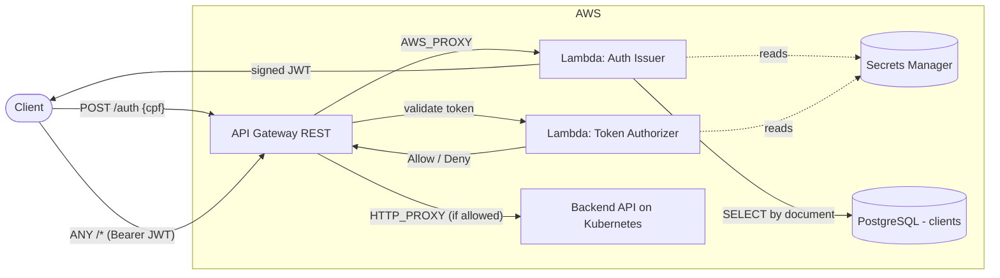
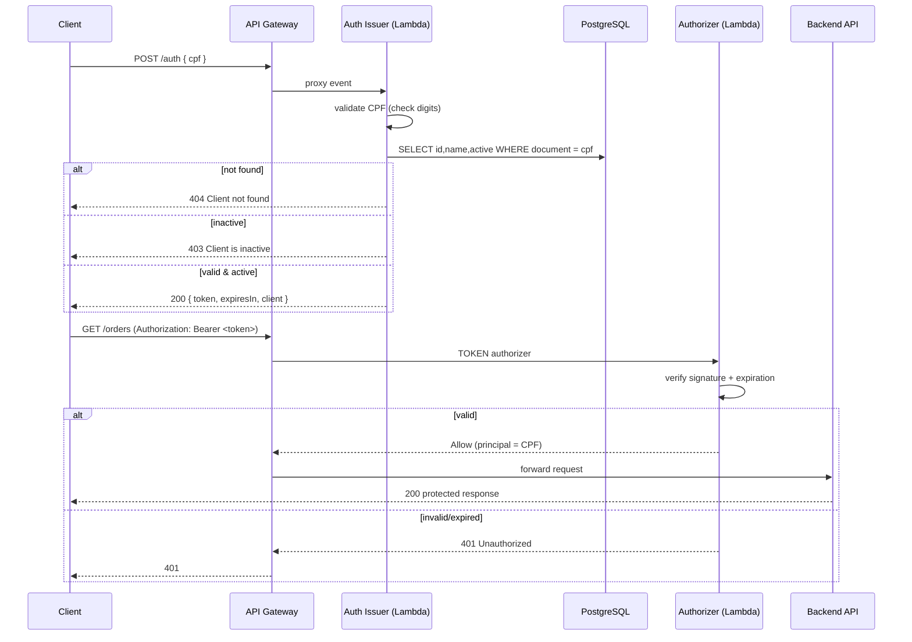

# os-management-lambda

Serverless **CPF authentication** for the os-management platform (FIAP SOAT — Tech Challenge Fase 3).

This repository contains the AWS Lambda functions and the Terraform/CI‑CD needed to:

1. **Issue tokens** — validate a client's CPF, confirm the client exists and is **active** in the database, and return a signed **JWT**.
2. **Authorize requests** — validate that JWT on protected API Gateway routes before traffic reaches the backend.

---

## Responsibilities (two functions, one contract)

| Function | Handler | Role |
|---|---|---|
| **Auth issuer** | `com.os.workshop.auth.AuthHandler` | `POST /auth` — validates CPF, checks client status in the DB, **issues** a JWT. Runs in the VPC to reach the database. |
| **Token authorizer** | `com.os.workshop.auth.TokenAuthorizerHandler` | API Gateway `TOKEN` authorizer — **validates** the JWT on protected routes. No DB access. |

Both sign/verify with the **same shared `JWT_SECRET`** (HS256), so tokens issued here are verifiable across the platform.

> The issuer only *issues*; the authorizer only *validates*. A client authenticates once at `/auth`, then sends `Authorization: Bearer <token>` on every protected call.

---

## Technologies

- **Java 21**, Maven (fat jar via `maven-shade-plugin`)
- **jjwt 0.13.0** (HS256) — same library/version as the main app
- **PostgreSQL JDBC** — lookup on `clients.document`
- **AWS Lambda** (functions) — provisioned with **Terraform**. The API Gateway that
  fronts these functions lives in the **`os-management-gateway`** repo and references
  them via `terraform_remote_state`.
- **AWS Secrets Manager** — managed store for `JWT_SECRET` and DB credentials
- **GitHub Actions** — CI (test + `terraform validate`) and CD (`develop`→homolog, `main`→prod)

---

## Architecture



### Authentication sequence



---

## API

### `POST /auth`

Request:

```json
{ "cpf": "529.982.247-25" }
```

CPF is accepted formatted or as raw digits.

Responses:

| Status | Body | Meaning |
|---|---|---|
| `200` | `{ "token": "...", "expiresIn": 86400000, "client": { "id": 1, "name": "JOAO DA SILVA" } }` | Authenticated |
| `400` | `{ "error": "Invalid CPF" }` / `{ "error": "CPF is required" }` | Bad/missing CPF |
| `404` | `{ "error": "Client not found" }` | No client with that document |
| `403` | `{ "error": "Client is inactive" }` | Client exists but is deactivated |

The JWT payload:

```json
{
  "sub": "52998224725",
  "clientId": 1,
  "name": "JOAO DA SILVA",
  "roles": ["CLIENT"],
  "iat": 1690000000,
  "exp": 1690086400
}
```

### Postman / Bruno

The platform API collection lives in the main `os-management` repo under `bruno/os-management-api` (`01 - Auth`). Point the `baseUrl` environment variable at the API Gateway stage URL (the `auth_endpoint` output of the **`os-management-gateway`** repo).

---

## Build & test locally

```bash
./mvnw clean verify        # compile + run unit tests
./mvnw package             # build the Lambda fat jar (target/os-management-lambda.jar)
```

## Deploy (Terraform)

Prerequisites: an S3 bucket for remote state, a VPC with subnets/security groups that can reach the database, and the backend URL.

```bash
cd terraform
cp terraform.tfvars.example terraform.tfvars   # fill in real values (never commit)

terraform init \
  -backend-config="bucket=<state-bucket>" \
  -backend-config="key=lambda/homolog/terraform.tfstate" \
  -backend-config="region=us-east-1"

terraform apply
```

Key outputs: `issuer_invoke_arn`, `authorizer_invoke_arn` (consumed by the gateway repo).

### Environment variables consumed by the functions

| Variable | Function | Purpose |
|---|---|---|
| `DB_URL`, `DB_USERNAME`, `DB_PASSWORD` | issuer | database connection |
| `JWT_SECRET` | issuer + authorizer | HS256 sign/verify (shared) |
| `JWT_EXPIRATION` | issuer | token lifetime (ms, default 86400000) |

---

## CI/CD

- **Branch protection:** `main` (prod) and `develop` (homolog) — no direct commits; merges via Pull Request.
- **CI** (`.github/workflows/ci.yml`): on PRs to `develop`/`main` and on `feature/**` pushes — runs Java tests and `terraform fmt`/`validate`.
- **CD** (`.github/workflows/cd.yml`): on push to `develop` → **homolog**, on push to `main` → **prod** — packages the jar and runs `terraform apply`. Branch → environment is derived in the workflow (no GitHub Environments needed), matching the os-management flat repo-secret convention.

### Shared infrastructure via remote state

VPC subnets, the EKS node security group, and the RDS JDBC URL are **read from the os-management EKS Terraform state** (`terraform_remote_state`), so they are **not** manual inputs here. This requires os-management to be deployed in EKS mode (`USE_EKS=true`) and to expose these root outputs: `private_subnet_ids`, `node_security_group_id`, `rds_jdbc_url`.

The issuer Lambda attaches to the EKS **node security group**, which is the SG the RDS instance already allows on port 5432.

### Required GitHub configuration (reused from os-management)

Repo **variables**: `TF_STATE_BUCKET`, `AWS_REGION`.

Repo **secrets**: `AWS_ACCESS_KEY_ID`, `AWS_SECRET_ACCESS_KEY`, `DB_USER`, `DB_PASSWORD`, `JWT_SECRET`.

> `DB_USER`, `DB_PASSWORD`, `JWT_SECRET`, `TF_STATE_BUCKET`, `AWS_REGION`, and the AWS keys use the **same names and values** as os-management — reuse them. Subnets, security group, and DB URL are not needed as secrets — they come from remote state. The backend URL (`ORIGIN_URL`) now lives in the **`os-management-gateway`** repo, not here.

---

## Notes

- Remember to add the **`soat-architecture`** user to this repository (Tech Challenge delivery requirement).
- Secrets are managed in AWS Secrets Manager and injected as Lambda environment variables so the function code stays runtime-agnostic; fetching them at runtime via the AWS SDK is a straightforward future hardening.
